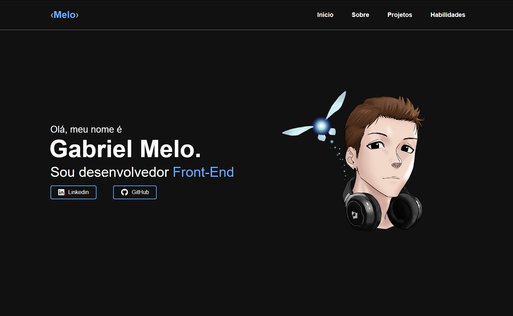

<h1 align="center">
  Portfólio - Gabriel Melo
</h1>

<h4 align="center"><a href="https://gabrielmelo29.github.io/Portfolio_Gabriel_Melo">Clique para visitar o projeto</a></h4>

## 📌 Seções

O site é composto por quatro seções:

- **Início:** Nele temos uma breve apresentação;
- **Sobre:** Nessa seção tenho uma descrição dizendo um pouco sobre quem sou;
- **Projetos:** Apresenta alguns projetos desenvolvidos e com link direto para visualização;
- **Habilidades:** Nele é apresentado meus conhecimentos em algumas linguagens com o foco no front-end;

---

## 🚀 Tecnologias utilizadas

Para o desenvolvimento deste site utilizei as seguintes tecnologias:

- HTML e CSS;
- JavaScript;
- Git e Github;

---

Feito com ♥ by Gabriel Melo